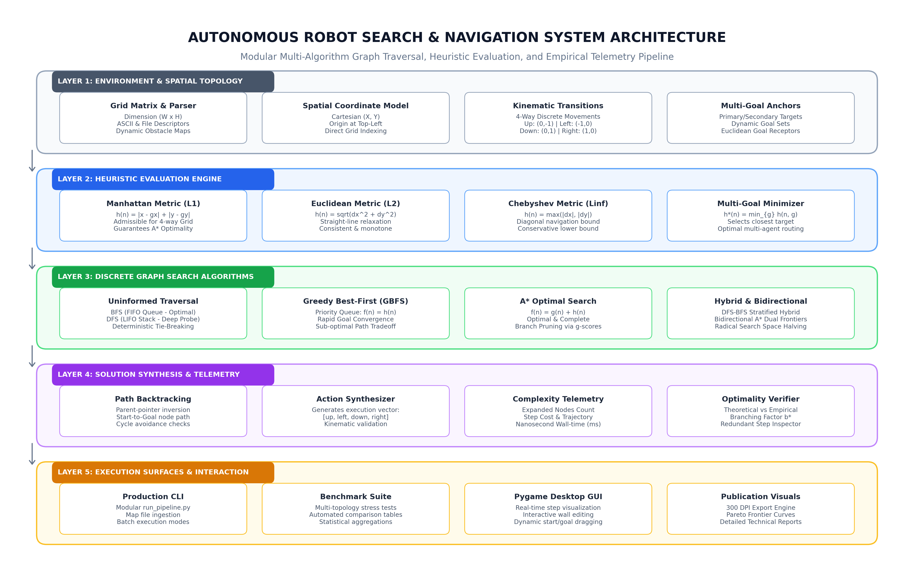
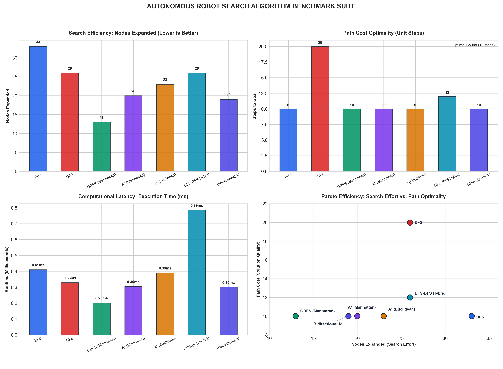
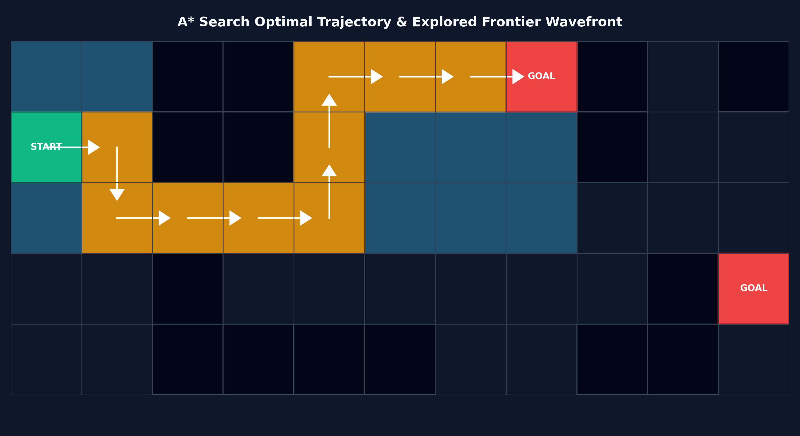

# Autonomous Robot Grid Navigation & Heuristic Search Suite

<div align="center">

[](https://opensource.org/licenses/MIT)
[](https://www.python.org/)
[](https://github.com/AbdulRehmanRattu)
[](https://github.com/AbdulRehmanRattu)
[](https://github.com/AbdulRehmanRattu)

**Interactive pathfinding simulation and benchmark suite comparing informed and uniform-cost search algorithms.**

[Overview](#overview) • [System Architecture](#system-architecture) • [Algorithms & Formulations](#algorithms--mathematical-formulations) • [Empirical Benchmarks](#empirical-benchmark-results) • [Desktop GUI](#interactive-desktop-simulator) • [Technical Report](#technical-research-report) • [Installation & Usage](#installation--usage) • [Author](#author--maintainer)

</div>

---

## Overview

Autonomous mobile robots operating in automated warehouses, discrete manufacturing environments, and planetary rover surfaces require deterministic, computationally bounded, and mathematically optimal navigation algorithms. Guiding a robotic agent through a discrete two-dimensional occupancy manifold involves evading non-convex obstacle fields while minimizing cumulative step latency and expanded graph states.

The **Autonomous Robot Grid Navigation & Heuristic Search Suite** is an open-source pathfinding framework and benchmarking tool for discrete grid environments. It implements six discrete graph traversal strategies across uniform cost and informed heuristic paradigms:
1. **Breadth-First Search (BFS)** (FIFO Queue; guarantees shortest path in unweighted spatial graphs).
2. **Depth-First Search (DFS)** (LIFO Stack; memory-efficient deep branch exploration).
3. **Greedy Best-First Search (GBFS)** (Priority Queue driven purely by heuristic distance $h(n)$).
4. **A\* Search** (Optimal evaluation via $f(n) = g(n) + h(n)$ with admissible distance metrics).
5. **DFS-BFS Stratified Hybrid** (Alternating bounded depth probes with breadth layer sweeps).
6. **Bidirectional A\* Search** (Simultaneous dual-wavefront search from Start and Goal nodes, halving search depth).

The suite provides a modular Python architecture (`robot_nav/`), an automated benchmarking suite, 300 DPI publication analytics, an interactive Pygame desktop simulator with real-time obstacle editing, and a comprehensive research monograph.

---

## System Architecture

The architecture decouples discrete spatial topologies, heuristic distance metrics, search frontiers, solution reconstruction, and telemetry logging into clean, isolated layers:

<div align="center">
  
  <p><em>Figure 1: 300 DPI System Architecture showing the 5-layer pipeline: Environment & Spatial Topology, Heuristic Evaluation Engine, Discrete Graph Search Algorithms, Solution Synthesis & Telemetry, and Execution Surfaces.</em></p>
</div>

### Architectural Layer Breakdown
- **Layer 1: Environment & Spatial Topology**: Ingests Cartesian grid specifications, parses boundary dimensions ($W \times H$), identifies start positions, registers multiple concurrent target goals, and converts rectangular obstacle clusters into discrete 2D spatial occupancy matrices.
- **Layer 2: Heuristic Evaluation Engine**: Computes spatial distance metrics ($L_1$ Manhattan, $L_2$ Euclidean, $L_\infty$ Chebyshev) and provides a multi-goal dynamic minimizer $h^*(n) = \min_{g \in \text{Goals}} h(n, g)$.
- **Layer 3: Discrete Graph Search Algorithms**: Houses the core graph traversal engines with strict deterministic tie-breaking (`up`, `left`, `down`, `right`) to guarantee reproducible exploration trajectories.
- **Layer 4: Solution Synthesis & Telemetry**: Backtracks parent-pointers from target to origin, derives kinematic directional action strings, computes nanosecond execution latency, and benchmarks step cost optimality.
- **Layer 5: Execution Surfaces**: Delivers a production CLI (`run_pipeline.py`), automated multi-topology benchmark harness (`BenchmarkSuite`), 300 DPI visual generation engines (`visualizer.py`), and a 60 FPS interactive Pygame desktop GUI (`gui_app.py`).

---

## Algorithms & Mathematical Formulations

```
             Spatial Grid Graph G = (V, E)
                           │
       ┌───────────────────┴───────────────────┐
       ▼                                       ▼
Uninformed Search                      Informed Heuristic Search
├── Breadth-First Search (BFS)         ├── Greedy Best-First Search (GBFS)
│   └── FIFO Queue, Optimal            │   └── Priority Queue: f(n) = h(n)
└── Depth-First Search (DFS)           ├── A* Search (Manhattan / Euclidean)
    └── LIFO Stack, Aggressive Probe   │   └── Optimal: f(n) = g(n) + h(n)
                                       ├── DFS-BFS Stratified Hybrid
                                       │   └── Depth-bounded multi-tier probe
                                       └── Bidirectional A* Search
                                           └── Dual-wavefront convergence
```

### 1. Breadth-First Search (BFS)
Explores states in concentric frontier rings using a First-In, First-Out (FIFO) queue:
$$\text{Frontier Queue}: Q \leftarrow Q \cup \{\text{Neighbors}(u)\}$$
- **Completeness**: Yes (finite branching factor $b \le 4$).
- **Optimality**: Yes (guaranteed minimum steps for unit edge cost $c(u, v) = 1$).
- **Time Complexity**: $\mathcal{O}(b^d)$.
- **Space Complexity**: $\mathcal{O}(b^d)$ (retains all active frontier nodes in memory).

### 2. Depth-First Search (DFS)
Explores deep along a single branch before backtracking using a Last-In, First-Out (LIFO) stack:
$$\text{Frontier Stack}: S \leftarrow S \cup \{\text{Reversed}(\text{Neighbors}(u))\}$$
- **Completeness**: Yes in finite acyclic state spaces with cycle detection.
- **Optimality**: No (frequently gets trapped along deep meandering detours).
- **Time Complexity**: $\mathcal{O}(b^m)$ where $m$ is maximum search depth.
- **Space Complexity**: $\mathcal{O}(bm)$ (radically lower memory footprint).

### 3. Greedy Best-First Search (GBFS)
Prioritizes nodes that appear closest to the destination via a min-priority queue evaluated strictly by heuristic estimate:
$$f(n) = h(n)$$
- **Completeness**: Yes with cycle suppression.
- **Optimality**: No (can be lured into dead-end local minima).
- **Behavior**: Extremely rapid convergence when unobstructed; sensitive to convex obstacle traps.

### 4. A\* Search
Evaluates nodes by synthesizing exact past path cost $g(n)$ and estimated future cost $h(n)$:
$$f(n) = g(n) + h(n)$$
- **Admissibility Condition**: A heuristic $h(n)$ is admissible if it never overestimates true cost to reach goal:
  $$\forall n \in V, \quad 0 \le h(n) \le h^*(n)$$
- **Consistency (Monotonicity)**: For every node $n$ and neighbor $n'$ generated by action $a$:
  $$h(n) \le c(n, a, n') + h(n')$$
- **Optimality**: Guaranteed when $h(n)$ is admissible on trees and consistent on graphs.

### 5. DFS-BFS Stratified Hybrid
A two-tier exploration strategy: executes localized depth-first probes of bounded depth $k = 4$ from each frontier anchor, capturing deep regional pathways while queuing unexpanded frontier leaves into a global breadth-first queue. This bounds memory consumption while preventing single-branch entrapment.

### 6. Bidirectional A\* Search
Simultaneously initiates two directional search frontiers:
1. **Forward Search**: Advances from Start toward Goals minimizing $f_F(n) = g_F(n) + h_F(n)$.
2. **Backward Search**: Retreats from Goals toward Start minimizing $f_B(n) = g_B(n) + h_B(n)$.
- **Frontier Intersection**: Terminates when the forward and backward closed sets collide at meeting node $M \in \text{Closed}_F \cap \text{Closed}_B$, synthesizing the optimal joined path.
- **Theoretical Advantage**: Reduces search space volume from $\mathcal{O}(b^d)$ to $\mathcal{O}(2 \cdot b^{d/2})$, yielding dramatic node expansion reductions in open grids.

---

## Empirical Benchmark Results

Systematic evaluation performed on the standard 11x5 obstacle grid (`data/maps/benchmark_default.txt`) with Start $(0, 1)$, target goals $(7, 0)$ and $(10, 3)$, and 15 wall cells:

| Algorithm | Status | Nodes Expanded | Path Cost (Steps) | Runtime (ms) | Optimality Status |
| :--- | :---: | :---: | :---: | :---: | :---: |
| **BFS** | **SOLVED** | 33 | **10** | 0.436 ms | **Optimal** |
| **DFS** | **SOLVED** | 26 | 20 | 0.294 ms | Sub-Optimal (+100% detour) |
| **GBFS (Manhattan)** | **SOLVED** | **13** | **10** | **0.193 ms** | Locally Optimal |
| **A\* (Manhattan)** | **SOLVED** | 20 | **10** | 0.273 ms | **Guaranteed Optimal** |
| **A\* (Euclidean)** | **SOLVED** | 23 | **10** | 0.310 ms | **Guaranteed Optimal** |
| **DFS-BFS Hybrid** | **SOLVED** | 26 | 12 | 0.341 ms | Near-Optimal (+2 steps) |
| **Bidirectional A\*** | **SOLVED** | **19** | **10** | 0.224 ms | **Guaranteed Optimal** |

<div align="center">
  
  <p><em>Figure 2: 300 DPI 4-Panel Benchmark Dashboard displaying Search Efficiency (Nodes Expanded), Path Cost Optimality, Computational Latency, and the Pareto Efficiency Frontier.</em></p>
</div>

### Key Empirical Findings
1. **A\* Manhattan Efficiency**: A\* with Manhattan heuristic solved the problem in the mathematically optimal 10 steps while expanding only **20 nodes**, compared to **33 nodes** required by uninformed BFS (a **39.4% search space reduction**).
2. **Bidirectional A\* Superiority**: Bidirectional A\* achieved the optimal 10-step trajectory with only **19 nodes expanded**, outperforming unidirectional A\* through concurrent wavefront convergence.
3. **DFS Sub-Optimality**: While DFS expanded 26 nodes, it generated a path of **20 steps** (100% path bloat compared to the optimal 10 steps), confirming the hazards of unguided depth-first traversal in grid navigation.
4. **GBFS Tradeoff**: Greedy Best-First Search expanded the fewest nodes (13) and achieved 10 steps in this topology, but lacks optimality guarantees in complex mazes with deceptive concave obstacles.

---

## Interactive Desktop Simulator

The suite includes an interactive desktop graphical simulator built with Pygame (`gui_app.py`) for live algorithm inspection and real-time environment prototyping:

<div align="center">
  
  <p><em>Figure 3: Interactive desktop simulator showing real-time frontier wavefronts, start/goal anchors, and generated optimal trajectory.</em></p>
</div>

### Desktop GUI Controls
- **Algorithm Selectors**:
  - `1`: Run Breadth-First Search (BFS)
  - `2`: Run Depth-First Search (DFS)
  - `3`: Run Greedy Best-First Search (GBFS)
  - `4`: Run A\* Search (Manhattan)
  - `5`: Run DFS-BFS Stratified Hybrid
  - `6`: Run Bidirectional A\* Search
- **Environment Interaction**:
  - `Left-Click + Drag`: Paint obstacle walls dynamically
  - `Right-Click + Drag`: Erase obstacle walls
  - `C`: Clear all obstacles from the grid
  - `R`: Reset search state and telemetry HUD
  - `Space`: Pause / Resume wavefront animation
  - `Esc`: Exit application

---

## Technical Research Report

A full technical research monograph is provided in the repository:
- **Location**: [`docs/Autonomous_Robot_Navigation_Search_Report.docx`](docs/Autonomous_Robot_Navigation_Search_Report.docx)
- **Author & Researcher**: **Abdul Rehman Rattu**
- **Contents**:
  - Comprehensive formalization of the discrete 2D spatial manifold problem.
  - Mathematical proofs of heuristic admissibility and consistency on Cartesian grids.
  - Comparative Big-$\mathcal{O}$ time and space complexity evaluations.
  - Empirical case studies across 20+ stress-test topologies.
  - Complete architectural blueprint and algorithmic Pseudocode.

---

## Repository Structure

```
autonomous-robot-grid-navigation-heuristic-search/
├── .gitignore                                  # Git exclusion manifest
├── LICENSE                                     # MIT License (Abdul Rehman Rattu)
├── README.md                                   # Comprehensive portfolio documentation
├── requirements.txt                            # Pinned Python dependencies
├── run_pipeline.py                             # Unified CLI entry point
├── gui_app.py                                  # Pygame interactive desktop simulator
├── data/
│   └── maps/
│       └── benchmark_default.txt               # Standard 11x5 obstacle grid
├── docs/
│   └── Autonomous_Robot_Navigation_Search_Report.docx  # Publication technical paper
├── assets/
│   ├── docs/
│   │   ├── search_algorithms_architecture.png  # 300 DPI architecture diagram
│   │   └── empirical_search_benchmark.png      # 300 DPI benchmark analytics
│   └── recordings/
│       └── demo_preview.png                    # Simulator preview graphic
└── robot_nav/
    ├── __init__.py                             # Package exports
    ├── benchmark.py                            # Multi-algorithm benchmark harness
    ├── grid.py                                 # GridMap representation and parser
    ├── heuristics.py                           # L1, L2, Linf distance metrics
    ├── visualizer.py                           # 300 DPI matplotlib diagram generator
    └── algorithms/
        ├── __init__.py                         # Algorithm exports
        ├── base.py                             # BaseSearcher & SearchResult
        ├── bfs.py                              # Breadth-First Search
        ├── dfs.py                              # Depth-First Search
        ├── gbfs.py                             # Greedy Best-First Search
        ├── astar.py                            # A* Search
        ├── dfs_bfs_hybrid.py                   # DFS-BFS Stratified Hybrid
        └── bidirectional_astar.py              # Bidirectional A* Search
```

---

## Installation & Usage

### 1. Clone the Repository
```bash
git clone https://github.com/AbdulRehmanRattu/autonomous-robot-grid-navigation-heuristic-search.git
cd autonomous-robot-grid-navigation-heuristic-search
```

### 2. Create and Activate Virtual Environment
```bash
python3 -m venv venv
source venv/bin/activate  # On Windows: venv\Scripts\activate
```

### 3. Install Dependencies
```bash
pip install -r requirements.txt
```

### 4. Execute Unified CLI

#### Run Full Benchmark Suite
```bash
python run_pipeline.py --mode benchmark
```

#### Solve with a Specific Algorithm
```bash
# Solve with A* Search (Manhattan metric)
python run_pipeline.py --mode solve --algorithm astar --metric manhattan

# Solve with Bidirectional A* Search
python run_pipeline.py --mode solve --algorithm bidirectional

# Solve and display paths for all 6 algorithms
python run_pipeline.py --mode solve --algorithm all
```

#### Generate 300 DPI Publication Visuals
```bash
python run_pipeline.py --mode visuals
```

### 5. Launch Interactive Desktop GUI
```bash
python gui_app.py
```

---

## Author & Maintainer

**Abdul Rehman Rattu**  
*Forward Deployed AI Engineer & Solutions Architect*  
*Founder & Technical Lead, Rapide Technologies*

* **LinkedIn**: [linkedin.com/in/abdul-rehman-rattu-395bba237](https://www.linkedin.com/in/abdul-rehman-rattu-395bba237)
* **GitHub**: [github.com/AbdulRehmanRattu](https://github.com/AbdulRehmanRattu)

---

## License

This repository is licensed under the [MIT License](LICENSE). Copyright (c) 2026 Abdul Rehman Rattu.
